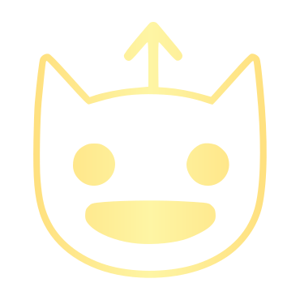

<div align="center">
  

  # EphemeralLinksReuploader

  *A Discord bot that preserves ephemeral links by reuploading their content as permanent attachments*

  
  
  
</div>

---

## What it does

When a user posts an ephemeral link (e.g. from 4chan) in a Discord channel, the bot:

1. Detects the link automatically
2. Downloads and reuploads the content as a Discord attachment
3. Posts it **as the original user** via webhook — seamlessly, as if nothing happened

The content remains accessible even after the original source goes offline or expires.

---

## Quick Start

### Docker Compose

```yaml
services:
  ephemeral-links-reuploader:
    image: dungfu/ephemeral-links-reuploader:latest
    container_name: ephemeral-links-reuploader
    restart: unless-stopped
    volumes:
      - /home/example/config:/config
      - /home/example/temp:/temp
    environment:
      - DISCORD_TOKEN=YOUR_DISCORD_BOT_TOKEN
```

### Volumes

| Path | Purpose |
|------|---------|
| `/config` | Bot configuration files |
| `/temp` | Temporary storage for downloads |

### Environment Variables

| Variable | Required | Description |
|----------|----------|-------------|
| `DISCORD_TOKEN` | Yes | Your Discord bot token |
